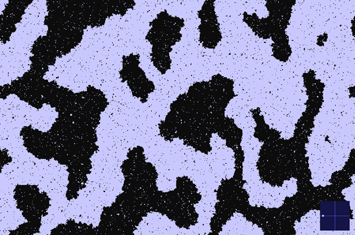

# Metropolis MCMC Simulation of Vapour-Phase Model

## How to Use

Once the simulation Window opens, use the arrow keys to change the simulation parameters.

- `RIGHT_ARROW` / `LEFT_ARROW` : Increase / Decrease Temperature, $T$
- `UP_ARROW` / `DOWN_ARROW` : Increase / Decrease Chemical Potential $\mu$
- `C` : Return to criticality $(\mu_{\text{Crit}}, T_\text{Crit})$
- `P` : Write current state to terminal

### What You Should be Able to Observe

#### Phase Change at Low $T$ and varying $\mu$

If T is low (but non-zero) you should see the system stabilise as either fully vapour or liquid. If you increase/decrease $\mu$ past $\mu_\text{Crit}$, then you should expect to see gradual condensation/boiling.

#### Metastability at Minimum $T$

If $T = 0$, then moving $\mu$ past $\mu_\text{Crit}$ will not induce phase change. Instead the system enters a metastable state, where any deviation from $T = 0$ will rapidly induce phase change.

#### Criticality

At $(\mu_\text{Crit}, T)$ the system is at a critical state, where neither the gaseous or liquid phases dominate. 

### Features
- C++17 for simulation logic, control flow, and performance-critical routines.
- CUDA kernels for massively parallel spin/particle updates.
- SDL2 for interactive graphics, window management, and user input (real-time parameter tuning).
- Real-time lattice rendering to visualize phase transitions and metastability.
- Lightweight logging of observables (energy, particle number, order parameters).

## Model

We use a grand canonical ensemble, i.e., the control parameters used are temperature $T$, chemical potential $\mu$ and volume $V$. Note that due to the finite lattice in our simulation, $V$ is inherently fixed, with the **fluctuating** parameters being energy, $E$, and number of particles, $N = \sum_i{n_i}$, where each particle has occupation $n_i \in {0, 1}$ (liquid or vapour).

$$
P(E, N) \propto e^{-\beta(E - \mu N)} \text{  where  } \beta = \frac{1}{k_B T}
$$

This weight function will be enforced by the Metropolis Markov-Chain Monte Carlo method.

### Acceptance Rule

A proposed move is accepted with probability

$$
p_\text{Accept} = \text{min}(1, e^{-\beta\Delta\Phi})
$$

where the grand potential change is

$$
\Delta\Phi = \Delta E - \mu \Delta N
$$

and 

$$
E[\{n_i\}] = - J \sum_{\langle i,j\rangle}n_i n_j + \epsilon \sum_i n_i
$$

Thus,

$$
p_\text{Accept} = \text{min}(1, e^{-\beta[\Delta (- J \sum_{\langle i,j\rangle}n_i n_j + \epsilon \sum_i n_i ) - \mu \Delta N]})
$$

Under these conditions, the critical temperature and chemical potentials are:
- $T_\text{Crit} = \frac{2J}{\ln(1 + \sqrt{2})}$
- $\mu_\text{Crit} = -2J$

### Moves

The canonical procedure for Metropolis-style Monte-Carlo is as follows:
- Select a site $i$ at random
- Propose flipping its state: $n_i \leftarrow 1 - n_i$
- This corresponds to $\Delta N = \pm 1$
- Compute $\Delta E$ from the Hamiltonian
- Accept the flip with probability $p_\text{accept}$

**Parellisation**

In serial MCMC, only one site is updated at a time. The simulation can be sped up significantly by updating multiple sites at parallel. Updating all sites simultaneously would break detailed balance, since $\Delta E$ depends on neighbouring states that may also be changing. To allow parallel updates, we use a checkerboard decomposition:
- Sites are divided into two interleaved sub-lattices (like a chessboard)
- Updates are proposed simulatenously on one-sub lattice, then on the other.
